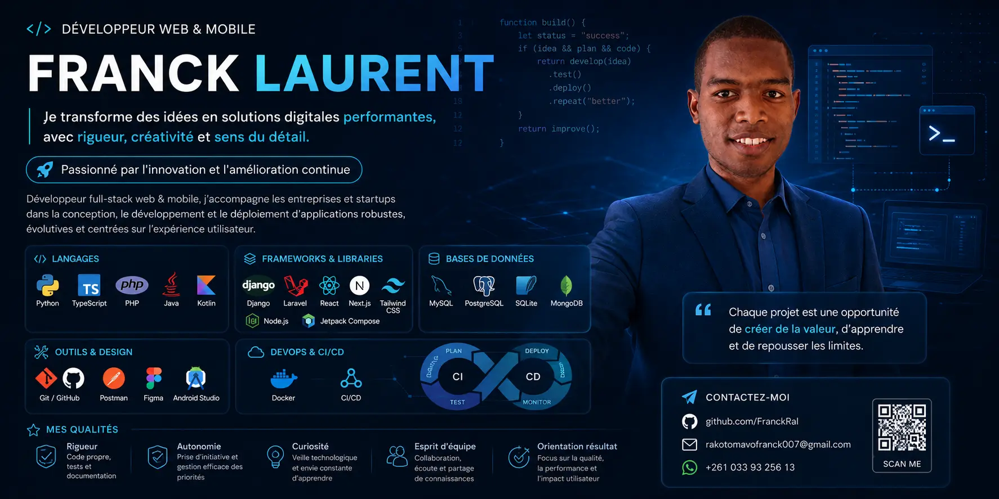

<h1 align="center">
Portfolio of Rakotomavo Franck
</h1>

Je transforme des idées en solution digitales <strong>performantes</strong> avec <strong>rigeur</strong>, <strong>créativité</strong> et <strong>sens du détail</strong>.

## 🚀 Tech Stack

### 🎨 Frontend

  
  
  

### ⚙️ Backend

  
  

### 🗄️ Database & Storage

  
  

### 🛠️ Tools & Deployment

  
  
  

## ✨ Features

- 🔐 **Secure Admin Dashboard** — Protected authentication powered by OAuth for secure administrative access.
- 🎨 **Modern & Responsive UI** — Clean, elegant interface built with Tailwind CSS 4 and fully responsive across all devices.
- 🌗 **Light & Dark Mode** — Seamless theme switching for a comfortable browsing experience.
- 🚀 **SEO Optimized** — Built with modern SEO best practices to maximize search engine visibility.
- 📧 **Email Integration** — Contact and notification system powered by Nodemailer.
- ☁️ **Cloud Media Management** — Optimized image upload, transformation, and delivery with Cloudinary.
- 🗄️ **Serverless Database** — Reliable PostgreSQL database hosted on Neon for scalability and performance.
- ⚡ **High Performance** — Powered by Next.js 16 with App Router, Server Components, and optimized rendering.
- 🤖 **AI Chat Assistant _(Coming Soon)_** — An intelligent assistant built with the OpenAI API, Next.js AI SDK, and Vercel AI Gateway to provide interactive support and answer visitors' questions in real time.

## Author
**RAKOTOMAVO Andritina Laurent Franck**

    

